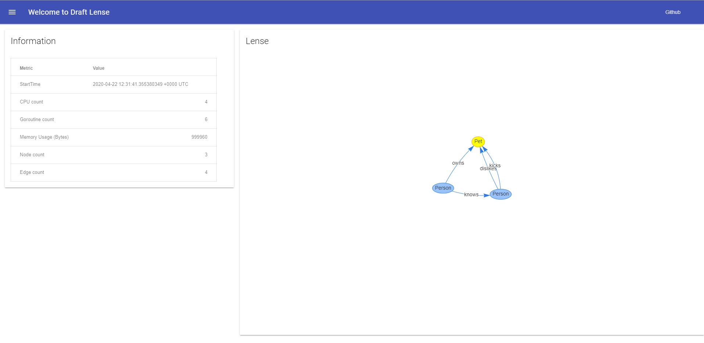

# Draft

Draft is is a simple, easy to use, and lightweight in memory graph store written in go.

**Please note that this is still under development and not ready for production use!**
**The API is not stable and updates may introduce breaking changes.**

## Run GRPC server

```bash
# example with running with `go run`
# assuming you are in cmd/server
$ go run *.go
2020/04/19 12:14:16 [run] Service accepting connections on [::]:8000
```


```bash
# example with running with `go run`
# assuming you are in cmd/server
$ go run *.go -addr localhost:1234
2020/04/19 12:14:16 [run] Service accepting connections on 127.0.0.1:1234
```

## Simple example client

Here is a very simple example client which will create two nodes and two edges between them
and it will iterate over all the edges.

```go
package main

import (
	"context"
	"flag"
	"io"
	"log"

	pb "github.com/jenmud/draft/service"
	"google.golang.org/grpc"
)

var (
	addr string = ":8000"
)

func init() {
	flag.StringVar(&addr, "addr", addr, "Server address and port to connect to.")
	flag.Parse()
}

func main() {
	ctx := context.Background()

	conn, err := grpc.DialContext(ctx, addr, grpc.WithInsecure(), grpc.WithBlock())
	if err != nil {
		log.Fatal(err)
	}

	defer conn.Close()

	client := pb.NewGraphClient(conn)

	n1 := pb.NodeReq{Uid: "node-1", Label: "Person"}
	n2 := pb.NodeReq{Uid: "node-2", Label: "Person"}

	_, err = client.AddNode(ctx, &n1)
	if err != nil {
		log.Fatal(err)
	}

	_, err = client.AddNode(ctx, &n2)
	if err != nil {
		log.Fatal(err)
	}

	client.AddEdge(ctx, &pb.EdgeReq{Uid: "edge-1", SourceUid: "node-1", Label: "knows", TargetUid: "node-1"})
	client.AddEdge(ctx, &pb.EdgeReq{Uid: "edge-2", SourceUid: "node-1", Label: "likes", TargetUid: "node-2"})

	estream, err := client.Edges(ctx, &pb.EdgesReq{})
	if err != nil {
		log.Printf("Error: %s", err)
	}

	for {
		e, err := estream.Recv()
		if err == io.EOF {
			break
		}

		log.Printf("Got Edge %s", e)
	}
}
```

## Web

Draft comes with a lightweight web visualization service for interacting and getting basic information about your graph and the service itself.

```bash
cmd/server/web$ go run main.go -addr :8000 -rpc-addr localhost:8001
```


